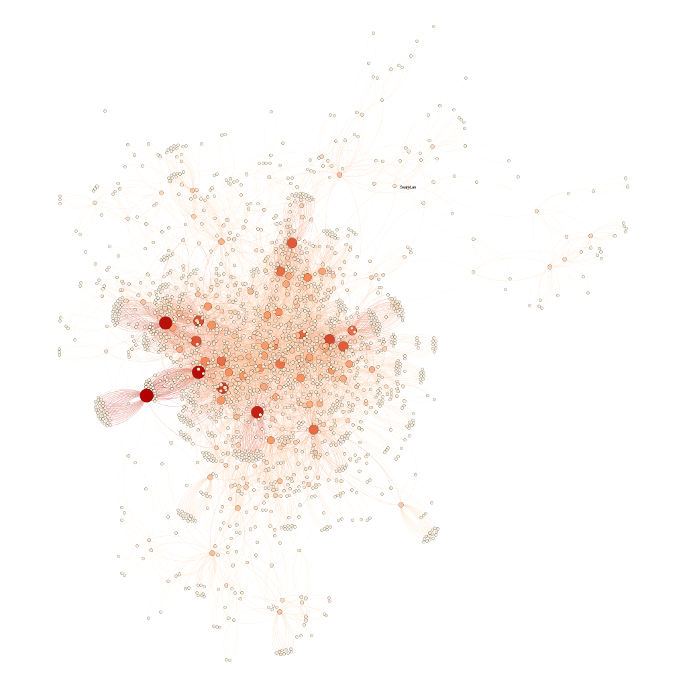

# Git-Friends
----------------
Use GitHub API to crawl the friendship between developers.

# Usage
## For those who want to crawl data by themselves
1. Remove the *.db file.
2. Set your user name and password of Github, which is used to Basic Auth.
3. Set the **login_name** as the BFS(bread-first-search) starting point.
4. Set the stop_account to the size you need.
5. Run **get_friends.py**, and the cleaned friend relationship graph is saved in **cleaned_data** file.
6. You can terminate the program anytime you want, it will automatically resume the progress it has achieved. So don't worry about interruption. However, only when the **stop_count** is met, the **cleaned_data** file will be generated.

## For those who just want to use the ready friendship data
* The *cleaned* data is store in **cleaned_data** file, and you can access it using `pickle` module:  
```python
try:  
    import cPickle as pickle  
except:  
    import pickle  
pickle_file = open('cleaned_data')  
cleaned_friends = pickle.load(pickle_file)
```  
* The starting point is my github account, i.e. Sean-Lan, and the relationship graph is saved as adjacent table.

## About data cleaning
Data cleaning is just removing the friends that not in the user list. Take the following graph as an example:  
> A: [B, C, D]  
> B: [A, C]  
> C: [A, B] 

After cleaning is:  
> A: [B, C]  
> B: [A, C]  
> C: [A, B]  

Since D is not in {A, B, C}. We need data cleaning because we set the stop count, and some users in someone's friends list haven't been crawled down.

## Relationship Graph
Using [Gephi](https://gephi.org/) to visualize the relationship:  

